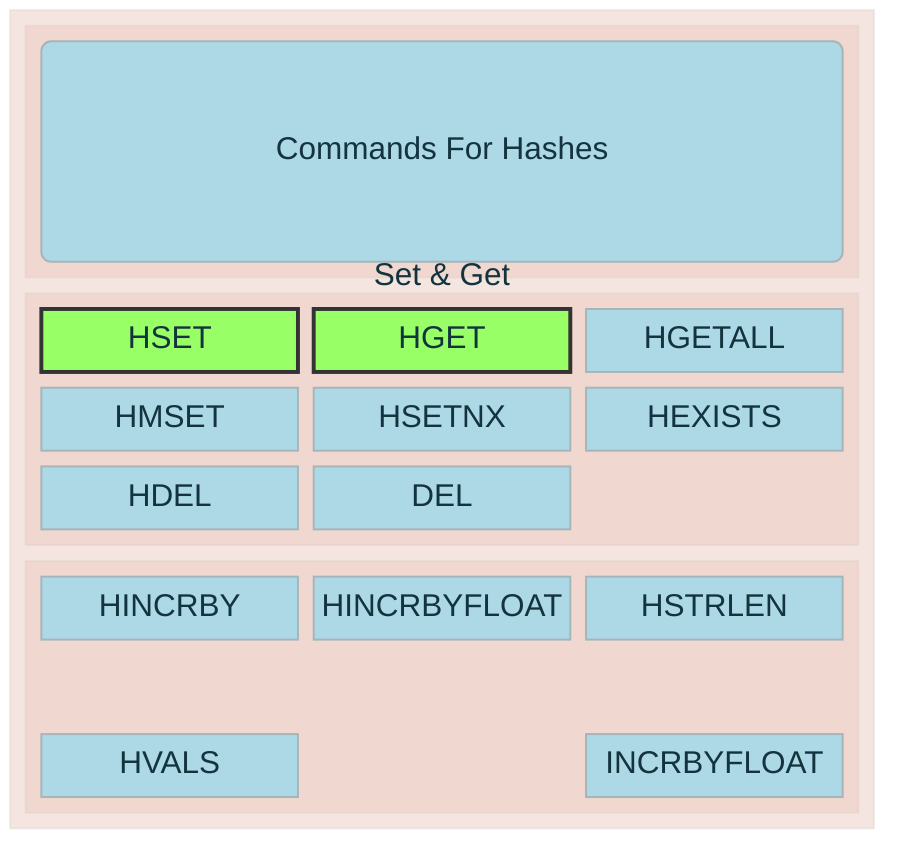

Redis hashes are a data structure that stores field-value pairs under a single key, similar to a dictionary or map within a single Redis key — useful for representing an object (e.g., a user record) without needing separate keys for each attribute.

# Core structure
A hash maps field names to values, all nested under one key. For example, a user object could be stored as key user:1000 with fields name, email, age, rather than three separate string keys.

| Command                                | Purpose                              |
| -------------------------------------- | ------------------------------------ |
| HSET key field value [field value ...] | Set one or more field-value pairs    |
| HGET key field                         | Get the value of a single field      |
| HMGET key field1 field2 ...            | Get multiple fields at once          |
| HGETALL key                            | Get all fields and values            |
| HDEL key field                         | Delete a field                       |
| HEXISTS key field                      | Check if a field exists              |
| HINCRBY key field increment            | Atomically increment a numeric field |
| HLEN key                               | Count the number of fields           |
| `HKEYS` / `HVALS`                      | Get only field names or only values  |

# Why use hashes instead of plain strings
* Memory efficiency: Redis internally optimizes small hashes (below configurable thresholds hash-max-listpack-entries / hash-max-listpack-value) into a compact listpack encoding, using far less memory than storing each field as its own string key.
* Logical grouping: Related fields live under one key, making it natural to model objects/records (user profiles, session data, product attributes) and to expire or delete them as a unit.
* Atomic partial updates: You can update or increment individual fields (e.g., a view counter) without reading/writing the whole object, unlike a JSON blob stored as a plain string.

# Common use cases
* Representing objects (user sessions, product catalogs, config settings)
* Caching database rows where you need field-level access
* Counters grouped by category (e.g., HINCRBY stats:page_views home 1)

# Limitations
* No nested structures — values are always plain strings/bytes; storing nested objects requires serialization (e.g., JSON) as a value, which loses field-level atomicity.
* Not ideal for very large hashes with huge values, since Redis converts to a hash-table encoding beyond the listpack thresholds, increasing memory overhead per field.
* No native TTL per field (only per key, until Redis 7.4+ introduced HEXPIRE for field-level TTLs).