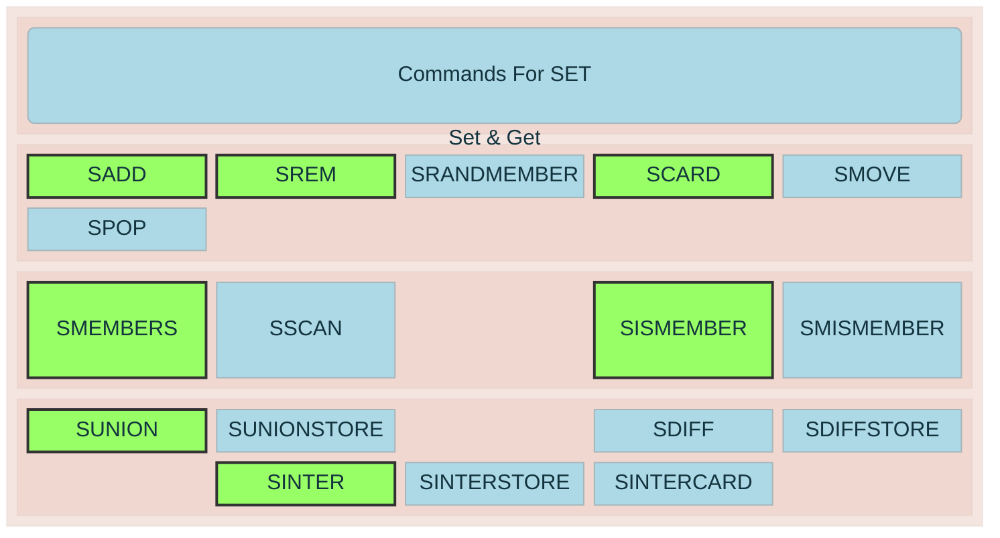

A Redis **set** is an unordered collection of unique string members. Adding the same member more than once has no effect.



```redis
SADD users:active alice bob charlie
SADD users:active alice       # ignored; already exists

SMEMBERS users:active         # returns all members, in no guaranteed order
SCARD users:active            # returns 3
SISMEMBER users:active alice  # returns 1
```

# Common commands

| Command                        | Purpose                                     |
| ------------------------------ | ------------------------------------------- |
| `SADD key member [member ...]` | add members                                 |
| `SREM key member [member ...]` | remove members                              |
| `SMEMBERS key`                 | return all members                          |
| `SISMEMBER key member`         | test membership                             |
| `SCARD key`                    | count members                               |
| `SPOP key [count]`             | remove and return random members            |
| `SRANDMEMBER key [count]`      | return random members without removing them |

# Set operations
```redis
SADD developers alice bob
SADD managers bob charlie

SINTER developers managers   # bob: in both sets
SUNION developers managers   # alice, bob, charlie
SDIFF developers managers    # alice: in developers but not managers
```

These operations are useful for relationships, permissions, tags, unique visitors, and membership lists.

Most add, remove, and membership checks are `O(1)`. Avoid `SMEMBERS` on very large sets because it returns the entire set; use `SSCAN` for incremental iteration instead.
