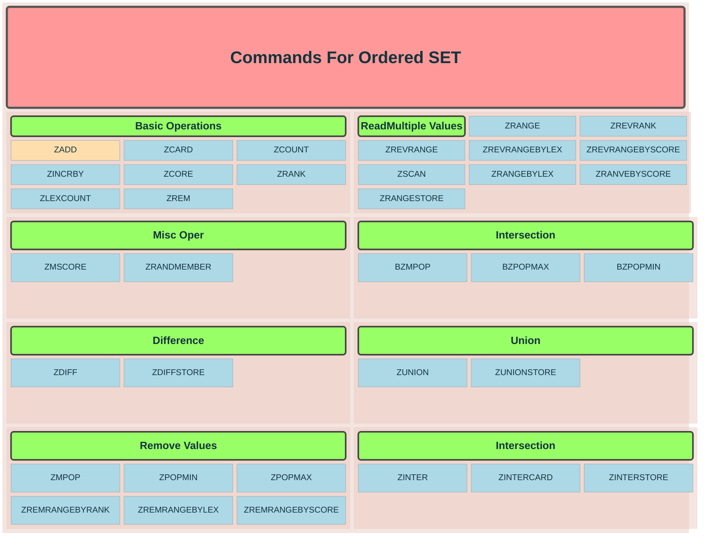

A Redis **sorted set** is a collection of unique members, each associated with a numeric **score**. Redis keeps members ordered by score; ties are ordered lexicographically.

```redis
ZADD leaderboard 150 alice
ZADD leaderboard 220 bob
ZADD leaderboard 180 charlie

ZREVRANGE leaderboard 0 2 WITHSCORES
```

Result: highest scores first—`bob`, `charlie`, `alice`. `ZRANGE` returns lowest-to-highest; `ZREVRANGE` returns highest-to-lowest.

# Common commands

| Command                           | Purpose                     |
| --------------------------------- | --------------------------- |
| ZSCORE leaderboard alice          | Get Alice's score           |
| ZRANK leaderboard alice           | Ascending rank              |
| ZREVRANK leaderboard alice        | Descending rank             |
| ZINCRBY leaderboard 25 alice      | Add 25 points               |
| ZCARD leaderboard                 | Count members               |
| ZREM leaderboard alice            | Remove a member             |
| ZRANGEBYSCORE leaderboard 150 200 | Members with scores 150–200 |

`ZADD` updates a member’s score if that member already exists, and `ZINCRBY` increments the score.



# Common use cases

- Leaderboards
- Priority queues
- Time-ordered events, using timestamps as scores
- Sliding-window rate limiters
- Scheduling tasks for execution at a specific time

Most sorted-set operations are `O(log N)`. Large `ZRANGE` results can be expensive because the cost also depends on how many members are returned.
