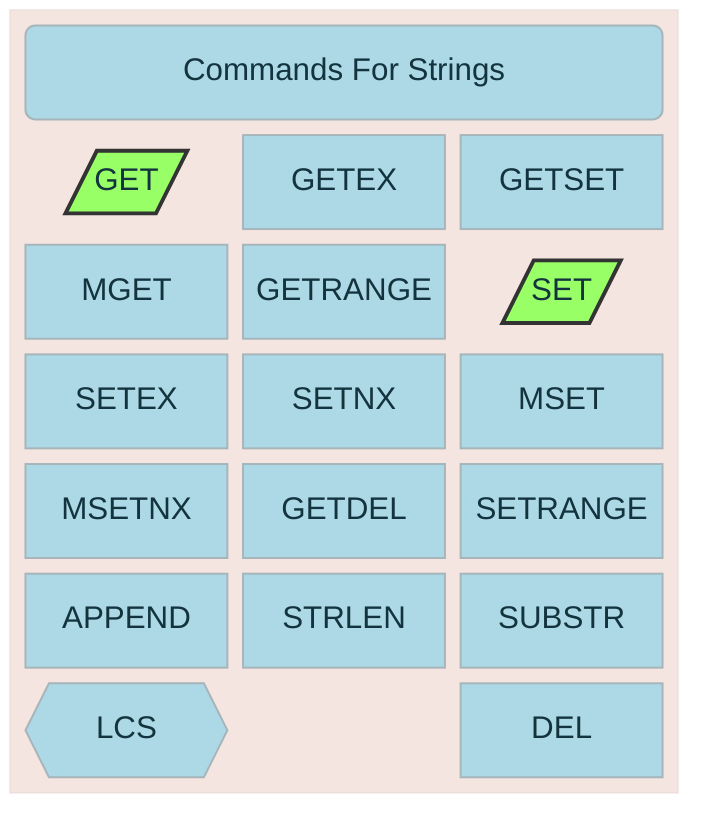
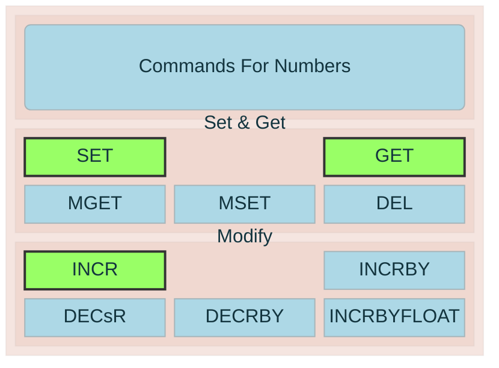

# Basic Key Values - Strings
All values in Redis are strings.

# Numbers
Numbers are also stored as strings. There are some commands to operate on numbers without manually get-modify-set.

# Data Structures

## Hash
Commands for attributes in the hash.
## Set
